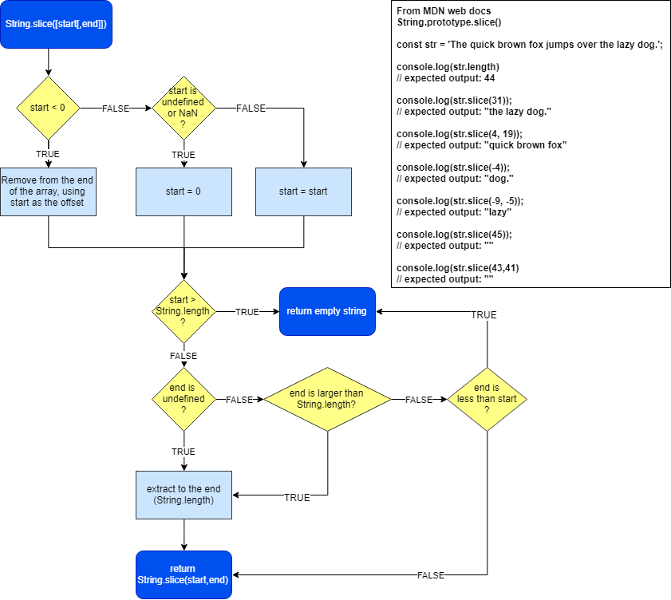

# Basic Algorithm Scripting: Slice and Splice

## Prompt

You are given two arrays and an index.

Copy each element of the first array into the second array, in order.

Begin inserting elements at index n of the second array.

Return the resulting array. The input arrays should remain the same after the function runs.

## Solution

### splice

The `splice` method accepts three arguments in this example; `n`, the index to start the splice; `0`, the number of items to remove, and `val`, what to add.


```JavaScript
function frankenSplice(arr1, arr2, n) {
  arr1.forEach(val => {
      arr2.splice(n,0,val);
      n++;
    }
  );

  return arr2;//altered by the splice statement - fail!
}
```

However, the issue is that this alters `arr2` - in the prompt, it states that neither `arr1` nor `arr2` should be altered.

To get around this, I will use a temporary array, and populate it with the values from `arr2` using the spread operator, `...`

Since `n` is hard-coded into the `forEach` function, it will be incremented using `n++`; otherwise, the values from `arr1` will be added in reverse order (`3,2,1` instead of `1,2,3`). The prompt specifies that the values should be added in order.

#### Side Note
A `for` loop didn't quite make sense here. The index `n` would still need to be manually incremented for each item added to `arr3`.

```JavaScript
/**
 * frankenSplice
 * @param array : Array to add to arr2
 * @param array : Return array containing all values
 * @param int   : Index to start adding on to arr2
 * @return array : Array containing all elements
 */
function frankenSplice(arr1, arr2, n) {

  let arr3 = [...arr2];

  arr1.forEach(val => {
      arr3.splice(n,0,val);
      n++;
    }
  );

  return arr3;
}

frankenSplice([1, 2, 3], [4, 5, 6], 1);
//should return [4,1,2,3,5,6]
```

## SOLUTION 1

Solution 1 did not use the spread operator; instead, it used the `slice` method on `arr2`, assigning the result to a local variable.

Next, it used a `for` loop, splicing the local variable and adding `arr1[i]`, manually incrementing `n`.

```JavaScript
function frankenSplice(arr1, arr2, n) {
  // It's alive. It's alive!
  let localArray = arr2.slice();
  for (let i = 0; i < arr1.length; i++) {
    localArray.splice(n, 0, arr1[i]);
    n++;
  }
  return localArray;
}
```

## SOLUTION 2

As usual, there is an elegant solution which uses ES6 to prettify things.

Solution 2 using the spread operator within the splice function. Once again, a local variable is used to store the result of `arr2.slice`, and `splice` is used on that local variable.

The spread operator in the third parameter to `splice` indicates that all elements in `arr1` should be used.

Beautiful.

```JavaScript
function frankenSplice(arr1, arr2, n) {
  // It's alive. It's alive!
  let localArr = arr2.slice();
  localArr.splice(n, 0, ...arr1);
  return localArr;
}
```

#### Flowchart of String.slice()
