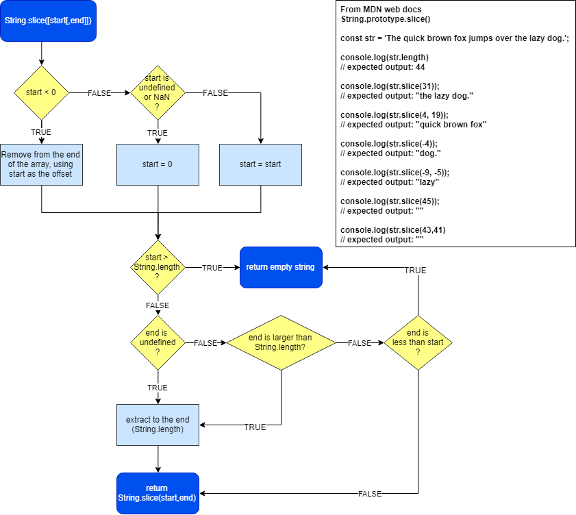
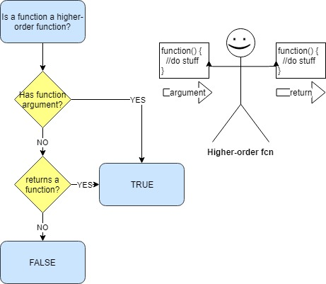
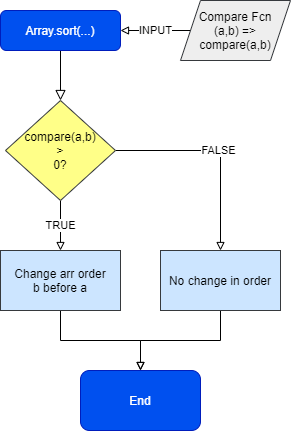

# Thank You

This set of notes is based on the [open source JavaScript curriculum](https://github.com/freeCodeCamp/freeCodeCamp/tree/master/curriculum/challenges/english/02-javascript-algorithms-and-data-structures) from freeCodeCamp.

Learn to code with [freeCodeCamp.org](https://freecodecamp.org)

## Inspired By freeCodeCamp

I created this repo, because I want to track my progress with freeCodeCamp, and because I just plain enjoy writing about code. Most of the content is Markdown or Text files, but occasionally, I will throw a [js script](https://github.com/hdevilbiss/freeCodeCampJS/tree/master/js) or [flowchart image](https://github.com/hdevilbiss/freeCodeCampJS/tree/master/images) in the top layer of the project.

### Note about posting on the FCC forum

When posting code to the freeCodeCamp forum, it should use markdown formatting and a `[details]` block.

[details]

```javascript
(() => console.log("Hello, world"))();
```

[/details]

### String.slice Flowchart

This graphic was created from my understanding of the Mozilla developer docs on the [String.slice method](https://developer.mozilla.org/en-US/docs/Web/JavaScript/Reference/Global_Objects/String/slice#Syntax).



#### Want to contribute?

If you want to contribute for whatever reason, then

1. View this repo on GitHub, then click on the Fork icon to create your own copy.
2. Make some commits on your copy of the repo.
3. Make a pull request into my copy of the repo.

#### Want to test out the JavaScript?

1. Be able to use `node` from your code editor's terminal; for example, install Node using [nvm](https://github.com/nvm-sh/nvm).
2. Run `node <path/to/js/file.js>`. For example, `node js/wherefore-art-thou.js`

## Functional Programming

There were a few core principles to functional programming outlined in the [freeCodeCamp.org](https://freecodecamp.org) preface.

**Functions should:**

1. Be independent, depending only on arguments.
2. Avoid state changes: leave global objects alone.
3. Produce minimal side effects.

We will learn how to break JavaScript in small, testable parts.

Just to be redundant, let's say it in another way.

Functions can be:

1. Isolated (No state dependence).
2. Pure (Same input, same output).
3. Limited in side effects, such as mutations.

## Callbacks

Callbacks are functions that get passed to another function to decide its outcome. For example, a callback function may be passed to a `filter` method to decide how to filter an array.

## First Class Functions

All JavaScript functions are first-class functions. First class functions can be:

- Assigned to a variable
- Passed to another function
- Returned from a function

## Higher Order Functions

Higher order functions either accept functions as arguments, or return functions.



## Lambda

The functions passed in, or returned, are known as _lambda_.

## Declarative vs. Imperative

> JavaScript offers many predefined methods that handle common tasks ... For example, instead of using the for loop mentioned above, you could call the map method which handles the details of iterating over an array.

The issue with mutation is that it can make it harder to debug your programs when something goes wrong. Changes to function arguments or global parameters can contribute to the confusion.

_... in functional programming, changing or altering things is called mutation, and the outcome is called a side effect_

## Recap on Two Principles for Functional Programming

1. Create new variables instead of altering existing variables.
2. Declare arguments for functions, and only operate on the arguments; leave the global object alone!

## The map array method

The `map` method is an iterator method which is used on an array directly. It receives a function, known as a **callback**, which acts on each item in the array.

It returns an array; a copy of the original array, that has been mutated by the callback function. The return array will be the same length as the original array.

Thankfully, the original array will not have been mutated. This means that `map` is a "pure" function.

According to [freeCodeCamp.org](https://freecodecamp.org), the callback function may receive up to three arguments:

1. the current element being processed,
2. the index of the current element being processed, and
3. the array on which `map` was called.

The `map` array method can be used to replace `for` loops, decreasing the syntactic overhead in code: simpler syntax means less likely to have syntax errors, right?

## The filter array method

The `filter` method is similar to the `map` method: it does not mutate the original array, and accepts the same arguments:

1. the current element being processed,
2. the index of the current element being processed, and
3. the array on which filter was called.

In its simplest form, the `filter` method uses the first argument and performs a simple conditional check on it.

```javascript
let sendSpamAboutMedicaid = (person) =>
  `${person}, you may be eligible for Medicaid.`;

let myArray = [
  { name: "Harry", age: 20 },
  { name: "Holly", age: 10 },
  { name: "Harriet", age: 65 },
  { name: "Heather", age: 16 },
  { name: "Hazel", age: 22 },
];

/**
 * Filter array by age >= 18
 */
let filteredArray = myArray.filter(
  (person) => person.age > 18 && person.age <= 64
);

console.log(filteredArray);

let mailingList = filteredArray.forEach((person) =>
  sendSpamAboutMedicaid(person)
);
```

Unlike the `map` method, the `filter` method does _not_ return an identically-lengthed array; it only returns values which pass the condition with truth.

## Array Mutation

> Functional programming is all about creating and using non-mutating functions.

### Slice vs. Splice

✔️ **Slice** **does not** mutate the original array, returning a copy.

❗ **Splice** **does** mutate the original array.

### Concatenation

✔️ **Concatenation** **does not** mutate any arrays, returning a new array.

### Pop, push, unshift, shift

❗ **Pop, push, unshift, and shift** all **do mutate** arrays.

### Reduce

The `reduce` method is similar to `filter`, `map`, and `forEach`.

The `reduce` method iterates over each value in an array, applies a callback function, and returns 1 value.

The `reduce` method itself takes 2 parameters:

1. The callback function
2. Initial value for the accumulator; _if not set_, then ...
   > ... the first iteration is skipped and the second iteration gets passed the first element of the array as the accumulator

The callback function given 🎁 to the `reduce` method may accept 4 arguments:

1. Accumulator: the return value from the previous iteration
2. Current element being processed
3. Index of the current element being processed
4. The original array on which `reduce` was called.

Hint hint: You can use destructuring on the parameters of the callback function to make your `reduce` method itself a functional program.

#### Note about using destructuring cleverly

In the `watchList` exercise to get the average rating of all Christopher Nolan films, it was my first instinct to use a separate counter variable inside my function, but outside of the reduce method. However, [using an object as the accumulator](https://github.com/hdevilbiss/freeCodeCampJS/blob/master/Functional%20Programming/use-the-reduce-method-to-analyze-data.md#solution-3) means that you can accumulate more than one item in your `reduce` method.

### Sort

The `sort` method appears to be a mutating array which defaults to sorting an array of characters by their respective Unicode values. The `sort` method expects a callback method as an argument.

> If `compareFunction(a,b)` returns a value greater than 0 for two elements `a` and `b`, then `b` will come before `a`. If `compareFunction(a,b)` returns a value equal to 0 for two elements `a` and `b`, then `a` and `b` will remain unchanged.



### Split

The `split` method is a String method which returns an array containing split pieces of the calling string. The `split` method expects an argument which can be a literal delimiter or a regular expression to match a variety of delimiters.

Because strings are immutable in JavaScript, the `split` method does not mutate its parameter.

### Join

The `join` method can be used to add strings in an array into one string. It expects a delimiter as its argument.

#### Example of Split with Join

Split an array at all special characters, then join the entries in the array together using a single space.

```javascript
function sentensify(str) {
  return str.split(/\s|,|-|\./).join(" ");
}
sentensify("May-the-force-be-with-you");
```

### Array.every method

The `every` method which receives a callback function. It enacts the callback function on every value in the array, and if each value returns true, then `every` returns true; false otherwise.

```javascript
let myArray = [900,10,34,1];

console.log(myArray.every(num => num < 100));//false
console.log(myArray.every(num) => num > 0);//true
```

### Array.some method

The `some` method is extremely similar to `every`, except that it returns true if _any_ value in the array fulfills the criterion(a).

```javascript
let myArray = [-1, 1, -2, -3];
console.log(myArray.some((val) => val > 0)); //true
```

### Arity and Currying

The **arity** of a function is the number of arguments that it receives.

**Currying** a function is the process of reducing function arity from N to 1.

A curried function has functions embedded inside of it.

```javascript
function uncurried(cumin, curryPowder, tikkaMasala) {
  return cumin.concat(curryPowder, tikkaMasala);
}

function curried(cumin) {
  return function (curryPowder) {
    return function (tikkaMasala) {
      return cumin.concat(curryPowder, tikkaMasala);
    };
  };
}
```

#### Currying in ES6

The above can be rewritten as such:

```javascript
const curried = (cumin) => (curryPowder) => (tikkaMasala) =>
  cumin.concat(curryPowder, tikkaMasala);
```

#### Impartial Binding

The `bind` method can be used on a function to apply only a portion of the arguments.

```javascript
function countThree(a, b, c) {
  return a + b + c;
}

let myCount = countThree.bind(this, 1, 4);

myCount(5); //returns 10
```
